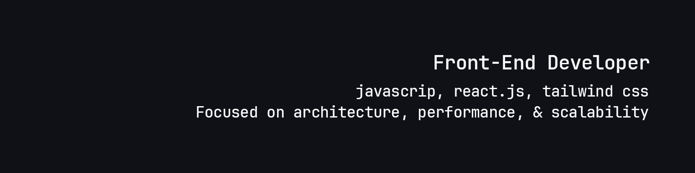

<h4> Olá! tudo bem? 👋   Meu nome é Gomes Alberto </h4>
 
- 🎓 Estudante de **Ciências da Computação** no IMETRO - Angola
- 🚀 Atualmente estudando **React.js e Tailwind CSS**
- 🎯 Criação de soluções com arquitetura organizada, priorizando performance e escalabilidade.

<h5> 💻 Tecnologias que uso </h5>

  <!-- HTML -->
  

  <!-- CSS -->
  

  <!-- JavaScript -->
  

  <!-- React -->
  

  <!-- Tailwind -->
  

<h5> 💻 Tecnologias que uso </h5>

<h4> 📊 Estatística do perfil </h4>

  
  

<h4> 📬 Bora trocar uma ideia? </h4>

  
  
  

  

