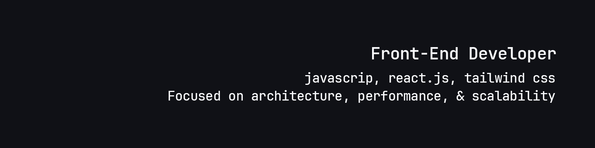

<h4> Olá! 👋   Eu sou Gomes Alberto </h4>
 
- 🎓 Estudante de Ciências da Computação no IMETRO - Angola
- 🎯 Atualmente aprofundando meus conhecimentos em React.js e Tailwind CSS
- 🌍 Aberto a novos desafios e oportunidades de aprendizado em ambientes remoto, híbrido ou presencial.

<h5> 💻 Tecnologias e ferramentas que uso </h5>

<h5> 📊 Estatística do perfil </h5>

  
  

<h5> 📬 Que tal trocarmos uma ideia? </h5>

<!-- EMAIL -->

<!-- LINKEDIN -->

<!-- WHATSAPP -->

<h5>Fique avontade para explorar meus projectos</h5>
